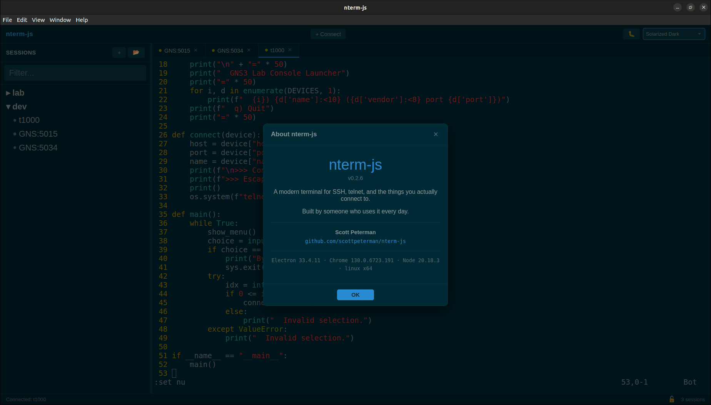
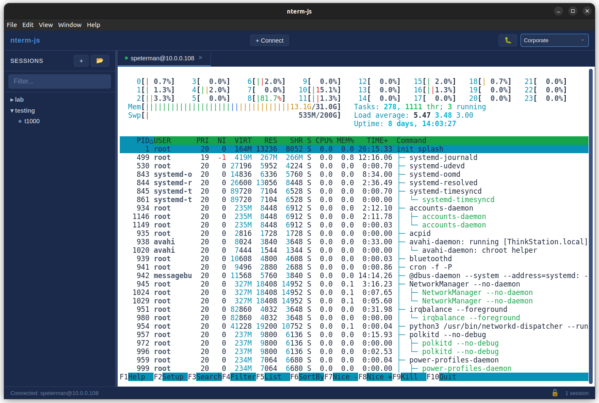
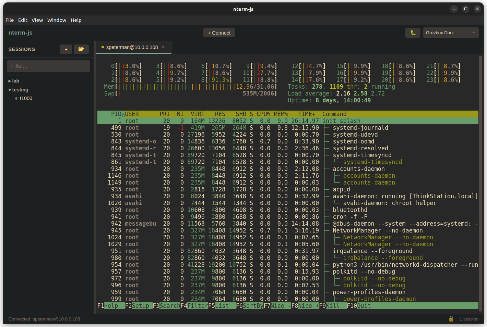
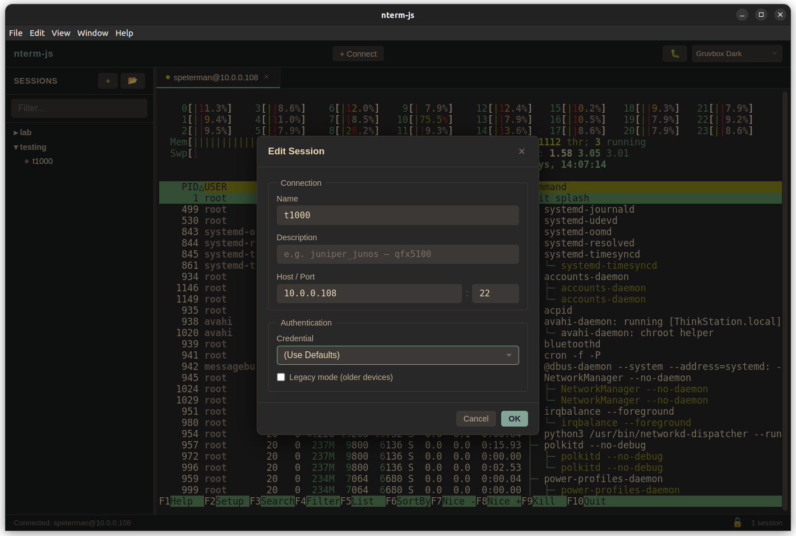
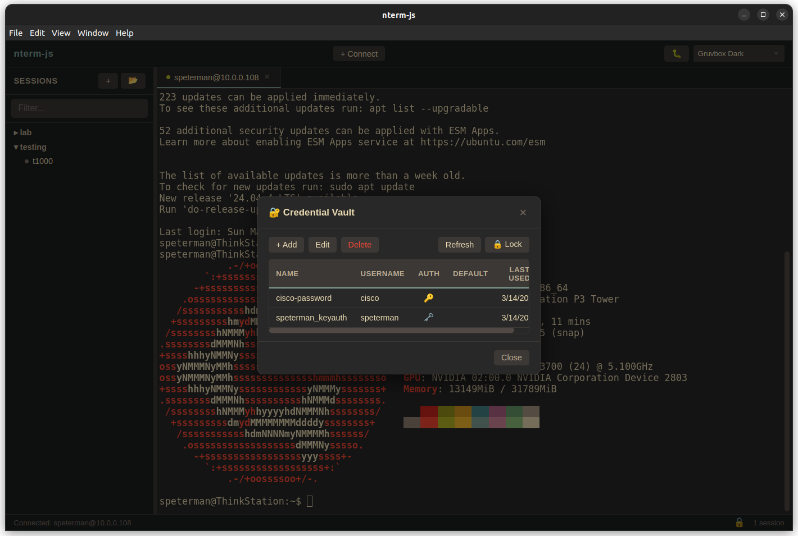

# nterm-js

**A network-aware SSH terminal for network engineers.**

Electron desktop app with multi-tab SSH, legacy device support, persistent settings, and session management. Pure JavaScript/TypeScript — no Python dependency.

Built for the same job as [nterm](https://github.com/scottpeterman/nterm-qt) and [nterm-ng](https://github.com/scottpeterman/nterm-ng), but designed to ship as a native installer that anyone can double-click and run.

[](screenshots/nterm1.gif)


---

## Why nterm-js

Every SSH terminal written for network engineers assumes you have Python installed, a working venv, and the patience to debug pip dependency conflicts. That's fine for automation engineers. It's a wall for everyone else.

nterm-js is a standalone desktop application. Download, install, connect. The SSH layer handles legacy Cisco, Juniper, and Arista gear out of the box — deprecated ciphers, keyboard-interactive auth, devices that reject shell requests. No configuration required.

The terminal is xterm.js — the same engine that powers VS Code's integrated terminal. Full VT100/ANSI support, 256-color, Unicode, box-drawing characters. It renders htop, vim, and your worst Cisco config equally well.

---

## Features

**SSH Terminal**
- xterm.js rendering — full color, resize, configurable scrollback
- Tab-per-session with connection status indicators (connecting / connected / error)
- 10 themes across dark and light variants (Catppuccin, Corporate, Darcula, Nord, Gruvbox, Solarized)
- Multi-line paste warning with preview and confirmation
- Configurable font size, font family, and cursor style
- Right-click context menu (Copy, Paste, Clear Terminal, Start/Stop Capture)

**Session Capture**
- ANSI-stripped session logging to file
- Per-session capture with start/stop toggle via context menu
- Native save dialog with auto-generated filenames (label + timestamp)
- Partial escape sequence buffering for clean output from slow connections
- Visual capture indicator (pulsing tab dot) while recording
- Automatic capture cleanup on tab close and window close

**Authentication**
- Password and keyboard-interactive (multi-language prompt detection)
- SSH key file with passphrase support
- SSH agent (Pageant on Windows, SSH_AUTH_SOCK on Linux/macOS)
- Default key discovery (~/.ssh/id_rsa, id_ed25519, id_ecdsa, id_dsa)
- Combined key + password authentication

**Credential Vault**
- AES-256-GCM encrypted credential storage (SQLite + Node.js crypto)
- PBKDF2-HMAC-SHA256 key derivation (480,000 iterations)
- Master password with verification token (password never stored)
- System keychain integration for auto-unlock (macOS Keychain, Windows DPAPI, Linux libsecret)
- Full CRUD credential manager UI with add/edit/delete
- Host pattern matching with glob wildcards (`10.0.*`, `*.lab.example.com`)
- Tag-based matching with score-weighted resolution
- Default credential fallback
- Jump host configuration per credential (forward-compatible)
- Connect dialog integration — "Vault Credential" auth method with dropdown
- Secrets never cross IPC — credentials resolved server-side before SSH connection
- Master password change with automatic re-encryption of all credentials

**Legacy Device Support**
- RSA SHA-1 fallback for OpenSSH < 7.2 servers
- Legacy KEX: diffie-hellman-group14-sha1, group1-sha1, group-exchange-sha1
- Legacy ciphers: aes128-cbc, 3des-cbc
- Shell → exec channel fallback for devices that reject shell requests
- Retry-with-legacy-algorithms as a user action
- Tested with Cisco IOS 12.2+, Junos 14.x+, Arista EOS, NX-OS

**Session Management**
- YAML/JSON session files with folder hierarchy
- Auto-reload of last sessions file on launch
- Session search and filter
- Connection dialog with auth method selector
- Native file browser for key selection
- Compatible with nterm / TerminalTelemetry session format

**Persistent Settings**
- Window position and size restored on launch
- Theme preference persisted across sessions
- Sidebar width, terminal font, cursor style, scrollback depth
- Default auth method and username
- Paste warning threshold
- Cross-platform storage (electron-store): `%APPDATA%` / `~/Library/Application Support` / `~/.config`

**Distribution**
- Cross-platform builds via electron-builder
- Linux: AppImage
- macOS: DMG (ARM64)
- Windows: NSIS installer

---

## Screenshots

| Corporate Light | Gruvbox Dark | Session Editor | Credential Vault |
|---|---|---|---|
| [](screenshots/corp-light-htop.png) | [](screenshots/gruv-htop.png) | [](screenshots/gruv-edit-session.png) | [](screenshots/vault1.png) |

| Corporate (dark) | Catppuccin Mocha | Solarized Light | Gruvbox Dark |
|---|---|---|---|
| [](screenshots/corporate.png) | [](screenshots/mocha.png) | [](screenshots/solarized-light.png) | [](screenshots/gruvbox-dark.png) |

---

## Install

### From Release

Download the installer for your platform from [Releases](https://github.com/scottpeterman/nterm-js/releases):
- **Linux**: `.AppImage`
- **macOS**: `.dmg` (ARM64)
- **Windows**: `.exe` installer

### From Source

```bash
git clone https://github.com/scottpeterman/nterm-js.git
cd nterm-js
npm install
npx @electron/rebuild -f -w better-sqlite3
npm start
```

Requires Node.js 20+ and npm. The `@electron/rebuild` step compiles `better-sqlite3` against Electron's Node.js headers (required for the credential vault).

---

## Architecture

```
src/
├── main/
│   ├── main.ts              # Electron main process — window lifecycle, IPC routing
│   │                        #   Session capture file I/O (open, write, close)
│   │                        #   Vault IPC registration · credential injection
│   ├── sshManager.ts        # SSH engine (ported from VS Code extension)
│   │                        #   ssh2 connections · full auth chain
│   │                        #   shell → exec fallback · legacy ciphers
│   │                        #   keyboard-interactive · key/agent auth
│   │                        #   UUID session management · diagnostics
│   ├── settings.ts          # Persistent settings (electron-store)
│   │                        #   Schema-validated · cross-platform paths
│   │                        #   Window bounds · theme · terminal prefs
│   ├── vaultCrypto.ts       # Encryption primitives (AES-256-GCM, PBKDF2)
│   ├── vaultStore.ts        # Credential storage (SQLite + encrypted fields)
│   │                        #   init/unlock/lock lifecycle · CRUD operations
│   │                        #   Master password change with re-encryption
│   ├── vaultKeychain.ts     # System keychain integration (Electron safeStorage)
│   ├── vaultResolver.ts     # Credential matching (glob patterns, tag scoring)
│   └── vaultIpc.ts          # Vault IPC handlers · connect-time credential injection
├── preload/
│   └── preload.ts            # Secure IPC bridge (window.nterm API)
│
└── renderer/
    ├── index.html            # Split layout: session tree + terminal tabs
    ├── renderer.js           # xterm.js terminals, tab management, dialogs
    │                         #   ANSI stripper · session capture · context menu
    ├── vault-ui.js           # Vault UI — unlock, credential manager, editor
    │                         #   Status indicator · connect dialog integration
    ├── themes.js             # Theme definitions (10 themes, dark + light)
    └── styles.css            # CSS variable theming
```

### Data Flow

```
 Keystrokes                                    Device Output
     │                                              │
     ▼                                              ▼
 xterm.js ──► preload IPC ──► main.ts ──► sshManager ──► ssh2
 (renderer)   (bridge)        (routes)    (all SSH logic)  (wire)
                                              │
                                              ▼
                                         ssh:message IPC
                                              │
                                              ▼
                                    renderer (writes to xterm.js)
                                              │
                                    ┌─────────┴─────────┐
                                    │                   │
                                    ▼                   ▼
                              term.write(raw)    AnsiStripper.strip()
                              (display)                 │
                                                        ▼
                                                  capture:write IPC
                                                        │
                                                        ▼
                                                  main: fs.writeSync()
                                                  (append to log file)
```

The SSH layer runs in the Electron main process. The renderer never touches Node.js or the network — it sends keystrokes through IPC and receives output through a single `ssh:message` channel. Context isolation is enforced.

Session capture taps the output stream in the renderer, strips ANSI escape sequences, and sends cleaned text to the main process for file I/O. The capture path is completely separate from the SSH path — sshManager is never touched.

Settings are owned by the main process (`settings.ts`) and exposed to the renderer through IPC. The renderer reads settings on startup for theme, font, and layout preferences.

### Credential Vault

```
                        ┌──────────────────────────────────────┐
                        │        Renderer (vault-ui.js)        │
                        │  Unlock dialog · Credential manager  │
                        │  Connect dialog "Vault Credential"   │
                        └──────────────┬───────────────────────┘
                                       │ IPC (metadata only — no secrets)
                        ┌──────────────▼───────────────────────┐
                        │         Main Process (vaultIpc.ts)    │
                        │  enrichSshConfig() at connect time    │
                        ├───────────────────────────────────────┤
                        │  vaultResolver.ts  — glob matching    │
                        │  vaultStore.ts     — SQLite CRUD      │
                        │  vaultCrypto.ts    — AES-256-GCM      │
                        │  vaultKeychain.ts  — OS keychain      │
                        └───────────────────────────────────────┘
                                       │
                        ┌──────────────▼───────────────────────┐
                        │         vault.db (SQLite)             │
                        │  vault_meta: salt, verify token       │
                        │  credentials: encrypted blobs         │
                        └───────────────────────────────────────┘
```

Secrets never cross the IPC boundary. The renderer sends a credential name; the main process resolves the actual password or SSH key from the encrypted vault and injects it into the SSH config before `sshManager.connectToHost()` executes. The connect dialog shows credential metadata (name, username, auth type) but never handles decrypted secrets.

The master password derives an AES-256 key via PBKDF2 (480,000 iterations). The key is held in memory only while unlocked and cleared on lock or window close. The optional system keychain caches the master password (not the derived key) for auto-unlock on next launch.

Vault storage location:
- **Windows**: `%APPDATA%/nterm-js/vault.db`
- **macOS**: `~/Library/Application Support/nterm-js/vault.db`
- **Linux**: `~/.config/nterm-js/vault.db`

### Origin

The SSH engine was ported from the [Terminal Telemetry VS Code extension](https://marketplace.visualstudio.com/items?itemName=ScottPeterman.terminal-telemetry) with two changes:

1. `vscode.Webview.postMessage()` → `BrowserWindow.webContents.send()`
2. VS Code logger → `electron-log`

All auth logic, legacy device handling, exec channel fallback, and diagnostic output carried over unchanged.

---

## Themes

nterm-js ships with 10 themes organized into dark and light groups:

| Dark | Light |
|---|---|
| Catppuccin Mocha | Catppuccin Latte |
| Corporate Dark | Corporate |
| Darcula | Solarized Light |
| Nord | Gruvbox Light |
| Gruvbox Dark | |
| Solarized Dark | |

Themes are selectable from the dropdown in the top bar. The selection persists across sessions. All UI elements — sidebar, tabs, dialogs, context menu, status bar — adapt to the active theme via CSS variables.

---

## Session File Format

Compatible with nterm and TerminalTelemetry YAML:

```yaml
- folder_name: Lab Switches
  sessions:
    - display_name: usa-leaf-1
      host: 192.168.1.101
      port: 22
      DeviceType: arista_eos
      username: admin
      password: admin

    - display_name: core-rtr-1
      host: 192.168.1.1
      port: 22
      DeviceType: cisco_ios
      username: admin
      # No password — opens connection dialog on connect
```

A Python conversion script is included for nterm-qt JSON exports:

```bash
python tools/convert_sessions.py nterm_sessions.json -o sessions.yaml
```

---

## Settings

Settings are stored in the OS-native config location and persist across sessions:

| Setting | Default | Description |
|---|---|---|
| `theme` | `catppuccin-mocha` | Named theme (see Themes section) |
| `terminalFontSize` | `14` | Terminal font size (8–32) |
| `terminalFontFamily` | Cascadia Code, Fira Code, Consolas | Terminal font stack |
| `cursorStyle` | `block` | `block`, `underline`, or `bar` |
| `cursorBlink` | `true` | Blinking cursor |
| `scrollbackLines` | `10000` | Scrollback buffer depth (500–100,000) |
| `sidebarWidth` | `220` | Session tree width in pixels |
| `pasteWarningThreshold` | `1` | Line count that triggers paste confirmation |
| `defaultUsername` | *(empty)* | Pre-filled username in connection dialog |
| `defaultAuthMethod` | `password` | Default auth method in connection dialog |
| `defaultLegacyMode` | `false` | Default legacy mode toggle |
| `lastSessionsFile` | *(empty)* | Auto-loaded on next launch |
| `windowBounds` | 1400×900 | Restored window position, size, maximized state |
| `vault.autoUnlock` | `true` | Auto-unlock vault from system keychain on launch |

Settings file location:
- **Windows**: `%APPDATA%/nterm-js/config.json`
- **macOS**: `~/Library/Application Support/nterm-js/config.json`
- **Linux**: `~/.config/nterm-js/config.json`

---

## Development

```bash
# Build and run
npm start

# Watch mode (recompiles TypeScript on save)
npm run watch
# Then in another terminal:
npx electron .

# Build distributables
npm run build:win      # Windows NSIS installer
npm run build:mac      # macOS DMG
npm run build:linux    # AppImage + deb
```

### Project Structure

TypeScript in `src/main/` and `src/preload/` compiles to `dist/`. The renderer is plain HTML, CSS, and JavaScript — no framework, no build step, directly debuggable.

---

## Roadmap

### Phase 1 — Terminal Features (current)

- [x] Multi-tab SSH terminal with xterm.js
- [x] Password, key file, SSH agent authentication
- [x] Legacy cipher/KEX support for older network devices
- [x] Shell → exec channel fallback
- [x] YAML/JSON session files with folder hierarchy
- [x] Connection dialog with auth method selector
- [x] Session search and filter
- [x] Persistent settings (window bounds, theme, terminal preferences)
- [x] Auto-reload last sessions file on launch
- [x] Multi-line paste warning with preview
- [x] Cross-platform builds (AppImage, DMG, NSIS)
- [x] 10 themes — dark and light (Catppuccin, Corporate, Darcula, Nord, Gruvbox, Solarized)
- [x] Session logging (ANSI-stripped capture to file with context menu toggle)
- [x] Right-click context menu (Copy, Paste, Capture, Clear)
- [x] Credential vault (AES-256-GCM, PBKDF2, pattern matching, system keychain)
- [ ] Auto-reconnect with exponential backoff
- [ ] Session editor (add/edit/delete/reorder)

### Phase 2 — Intelligence

- [ ] Sniffer pipeline (line accumulation → prompt detection → block extraction)
- [ ] Gutter bar (CRT amber marks alongside terminal)
- [ ] [tfsmjs](https://github.com/scottpeterman/tfsmjs) integration (TextFSM parsing in JavaScript)
- [ ] Visualizer (structured tables from parsed output)
- [ ] Context menu extensions (Copy Block, Export JSON/CSV/Markdown)

### Phase 3 — Distribution Polish

- [x] electron-builder packaging (Linux, macOS)
- [ ] Windows build testing
- [ ] Auto-update via electron-updater
- [ ] Code signing
- [ ] Installer branding
- [ ] GitHub Releases with platform binaries

---

## Ecosystem

nterm-js is the distributable terminal for a network management workflow. Telemetry and real-time device monitoring are handled by a separate companion application.

| Phase | Tool | Function |
|---|---|---|
| **Day 0** | [Secure Cartography](https://github.com/scottpeterman/secure_cartography) | Network discovery, topology mapping |
| **Day 1** | [VelocityCMDB](https://github.com/scottpeterman/velocitycmdb) | Device inventory, configuration management |
| **Day 2** | **nterm-js** | Operational terminal, real-time interaction |
| **Day 2** | Day 2 validation tools | fibtrace, trafikwatch, BGP validation |

When ecosystem tools are available, nterm-js session files can be generated from the CMDB. When they're not, nterm-js operates independently.

### Related Projects

- [nterm](https://github.com/scottpeterman/nterm-qt) — PyQt6 SSH terminal widget with scripting API
- [nterm-ng](https://github.com/scottpeterman/nterm-ng) — Network-aware SSH terminal with sniffer and telemetry (Python)
- [Terminal Telemetry](https://marketplace.visualstudio.com/items?itemName=ScottPeterman.terminal-telemetry) — VS Code SSH extension (origin of the SSH engine)
- [tfsmjs](https://github.com/scottpeterman/tfsmjs) — TextFSM JavaScript port (92% template compatibility)
- [SSHWontDie](https://github.com/scottpeterman/sshwontdie) — Multi-language SSH automation toolkit (origin of sshjs telemetry client)

---

## License

GPL-3.0

---

## Author

**Scott Peterman** — Principal Infrastructure Engineer
[github.com/scottpeterman](https://github.com/scottpeterman)